# 📸 Screenshots das 17 Páginas TeleMed
*Gerado automaticamente em 12/09/2025, 19:22:06*

## 📋 Sequência de Navegação Recomendada

Este documento apresenta as 17 páginas principais da plataforma TeleMed organizadas na sequência lógica de uso:

### 🔄 **Fluxo Completo do Usuário:**

## 🌟 1. ENTRADA E INFORMAÇÕES

### 1. Landing Page - Primeiro Contato
**URL:** `/lp.html`
**Link completo:** https://60caaae2-b759-4421-bea0-41165f6b95a2-00-3gqmyfv0qhnan.worf.replit.dev/lp.html

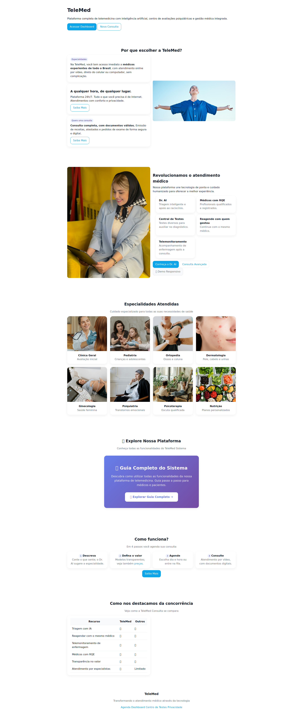

✅ **Status:** Screenshot capturado com sucesso

---

### 2. Como Funciona (Geral)
**URL:** `/como-funciona/`
**Link completo:** https://60caaae2-b759-4421-bea0-41165f6b95a2-00-3gqmyfv0qhnan.worf.replit.dev/como-funciona/

✅ **Status:** Screenshot capturado com sucesso

---

## 📝 2. CADASTRO E ONBOARDING

### 3. Cadastro de Paciente
**URL:** `/cadastro.html`
**Link completo:** https://60caaae2-b759-4421-bea0-41165f6b95a2-00-3gqmyfv0qhnan.worf.replit.dev/cadastro.html

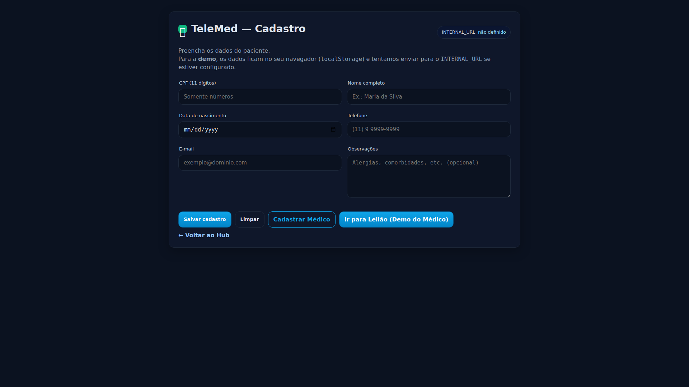

✅ **Status:** Screenshot capturado com sucesso

---

### 4. Cadastro de Médico
**URL:** `/cadastro-medico.html`
**Link completo:** https://60caaae2-b759-4421-bea0-41165f6b95a2-00-3gqmyfv0qhnan.worf.replit.dev/cadastro-medico.html

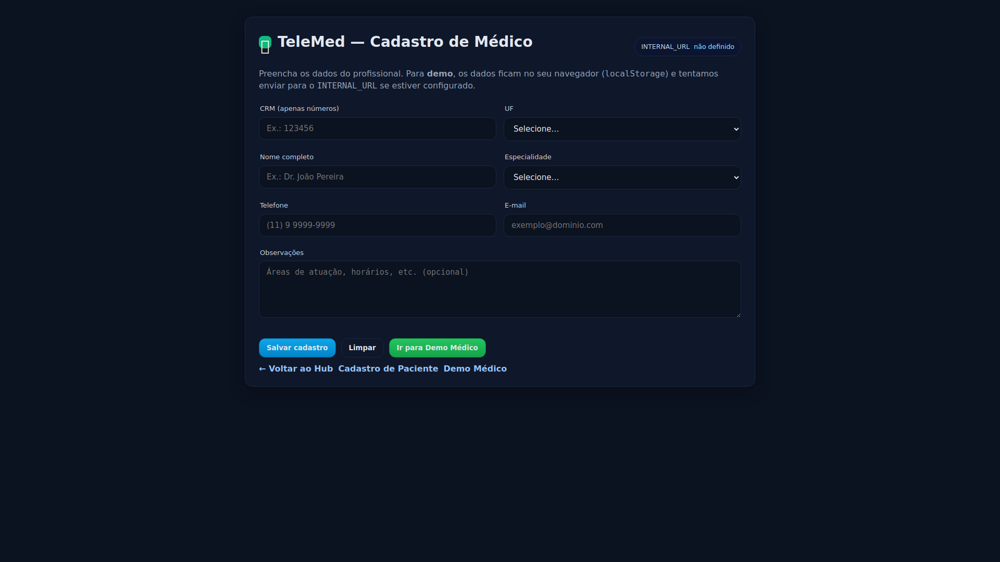

✅ **Status:** Screenshot capturado com sucesso

---

### 5. Como Funciona (Paciente)
**URL:** `/paciente/como-funciona.html`
**Link completo:** https://60caaae2-b759-4421-bea0-41165f6b95a2-00-3gqmyfv0qhnan.worf.replit.dev/paciente/como-funciona.html

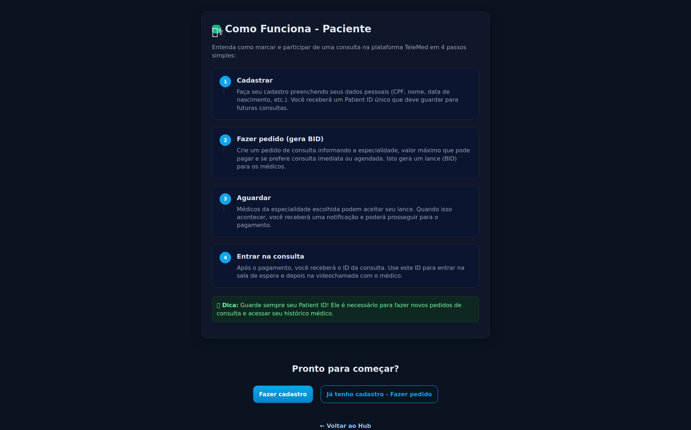

✅ **Status:** Screenshot capturado com sucesso

---

### 6. Como Funciona (Médico)
**URL:** `/medico/como-funciona.html`
**Link completo:** https://60caaae2-b759-4421-bea0-41165f6b95a2-00-3gqmyfv0qhnan.worf.replit.dev/medico/como-funciona.html

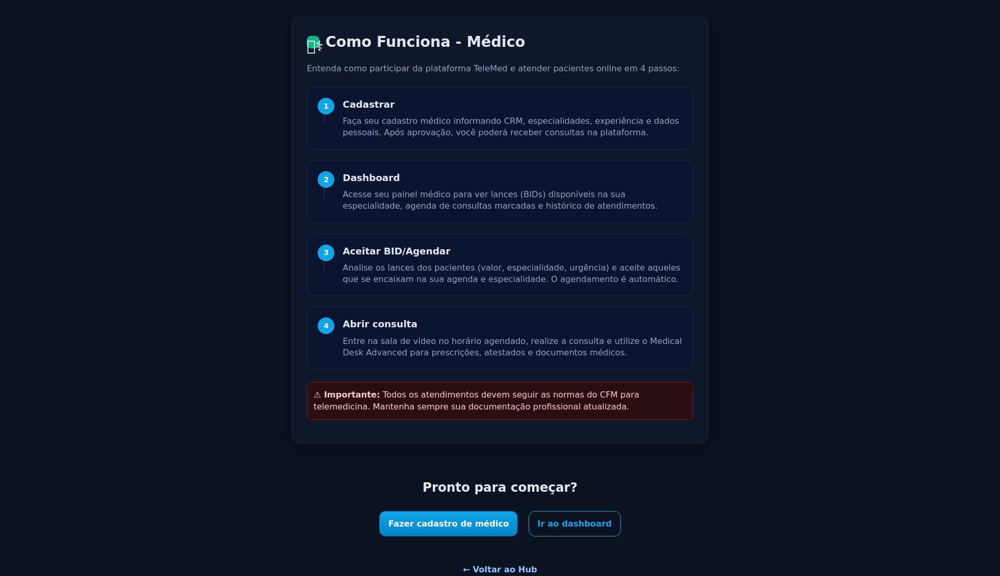

✅ **Status:** Screenshot capturado com sucesso

---

## 🏥 3. FLUXO PACIENTE

### 7. Pedido de Consulta
**URL:** `/paciente/pedido.html`
**Link completo:** https://60caaae2-b759-4421-bea0-41165f6b95a2-00-3gqmyfv0qhnan.worf.replit.dev/paciente/pedido.html

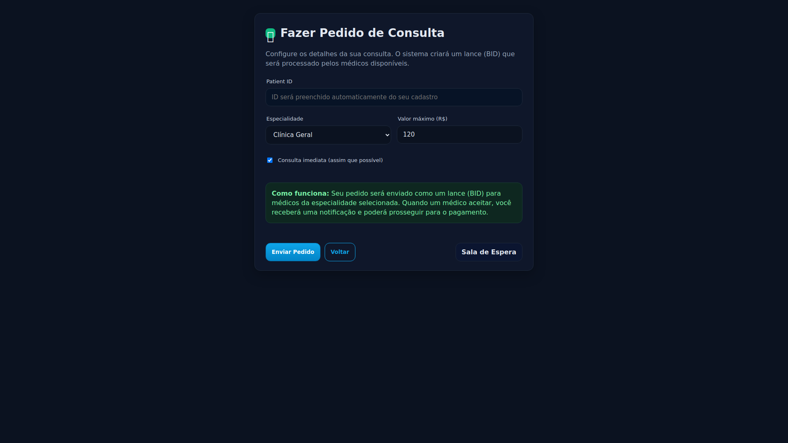

✅ **Status:** Screenshot capturado com sucesso

---

### 8. Preços e Planos
**URL:** `/precos/`
**Link completo:** https://60caaae2-b759-4421-bea0-41165f6b95a2-00-3gqmyfv0qhnan.worf.replit.dev/precos/

✅ **Status:** Screenshot capturado com sucesso

---

### 9. Sala de Espera
**URL:** `/sala-de-espera/`
**Link completo:** https://60caaae2-b759-4421-bea0-41165f6b95a2-00-3gqmyfv0qhnan.worf.replit.dev/sala-de-espera/

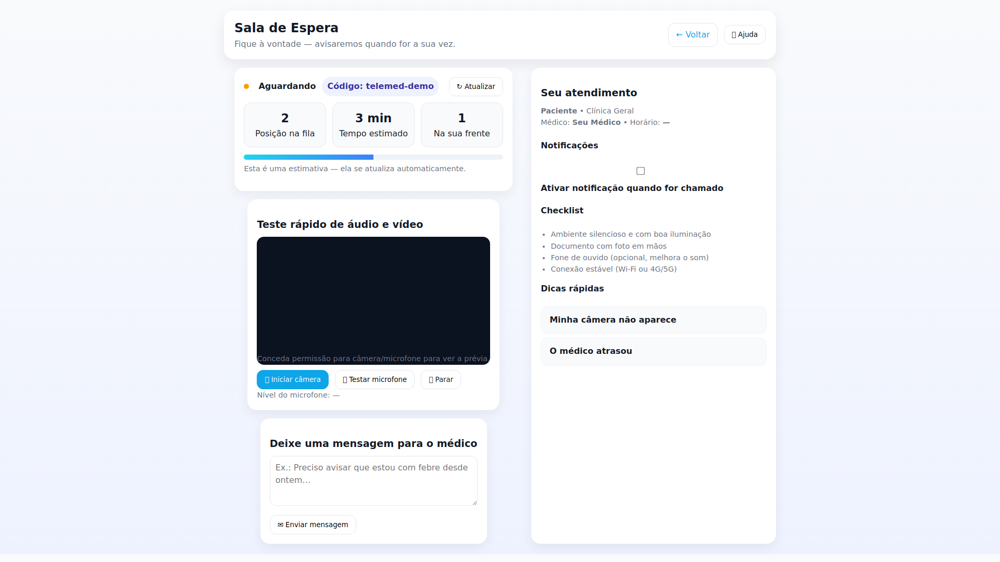

✅ **Status:** Screenshot capturado com sucesso

---

### 10. Consulta Online
**URL:** `/consulta/`
**Link completo:** https://60caaae2-b759-4421-bea0-41165f6b95a2-00-3gqmyfv0qhnan.worf.replit.dev/consulta/

❌ **Status:** Erro na captura
**Erro:** Navigation timeout of 30000 ms exceeded

---

### 11. Video Conferência
**URL:** `/video.html`
**Link completo:** https://60caaae2-b759-4421-bea0-41165f6b95a2-00-3gqmyfv0qhnan.worf.replit.dev/video.html

✅ **Status:** Screenshot capturado com sucesso

---

## 👩‍⚕️ 4. FLUXO MÉDICO

### 12. Portal Médico
**URL:** `/medico/`
**Link completo:** https://60caaae2-b759-4421-bea0-41165f6b95a2-00-3gqmyfv0qhnan.worf.replit.dev/medico/

✅ **Status:** Screenshot capturado com sucesso

---

### 13. Agenda Médica
**URL:** `/agenda/`
**Link completo:** https://60caaae2-b759-4421-bea0-41165f6b95a2-00-3gqmyfv0qhnan.worf.replit.dev/agenda/

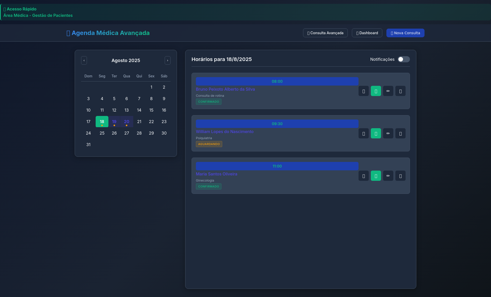

✅ **Status:** Screenshot capturado com sucesso

---

### 14. Meus Pacientes
**URL:** `/meus-pacientes/`
**Link completo:** https://60caaae2-b759-4421-bea0-41165f6b95a2-00-3gqmyfv0qhnan.worf.replit.dev/meus-pacientes/

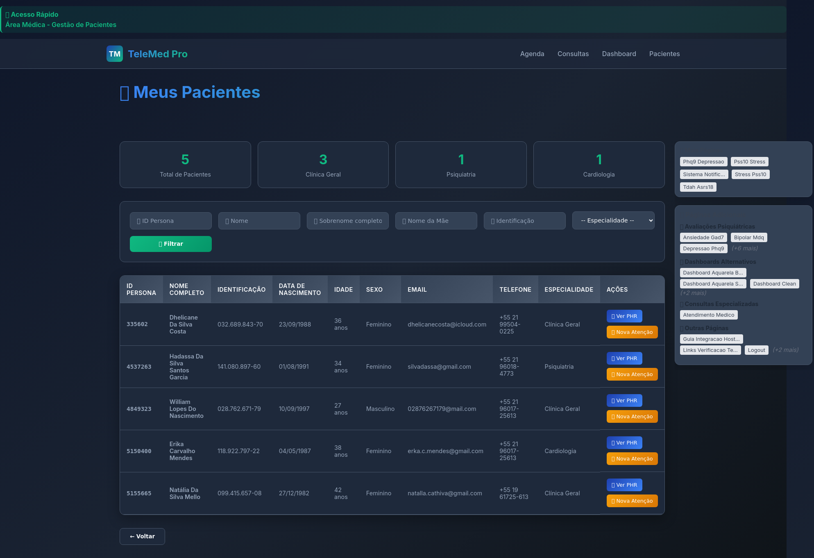

✅ **Status:** Screenshot capturado com sucesso

---

### 15. Dashboard
**URL:** `/dashboard/`
**Link completo:** https://60caaae2-b759-4421-bea0-41165f6b95a2-00-3gqmyfv0qhnan.worf.replit.dev/dashboard/

✅ **Status:** Screenshot capturado com sucesso

---

## 🤖 5. RECURSOS AVANÇADOS

### 16. Dr. AI - Assistente Médico
**URL:** `/dr-ai/`
**Link completo:** https://60caaae2-b759-4421-bea0-41165f6b95a2-00-3gqmyfv0qhnan.worf.replit.dev/dr-ai/

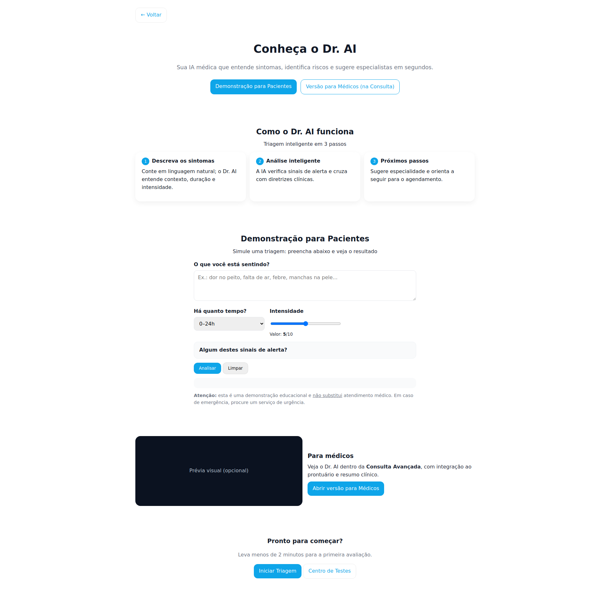

✅ **Status:** Screenshot capturado com sucesso

---

### 17. Centro de Testes
**URL:** `/centro-de-testes/`
**Link completo:** https://60caaae2-b759-4421-bea0-41165f6b95a2-00-3gqmyfv0qhnan.worf.replit.dev/centro-de-testes/

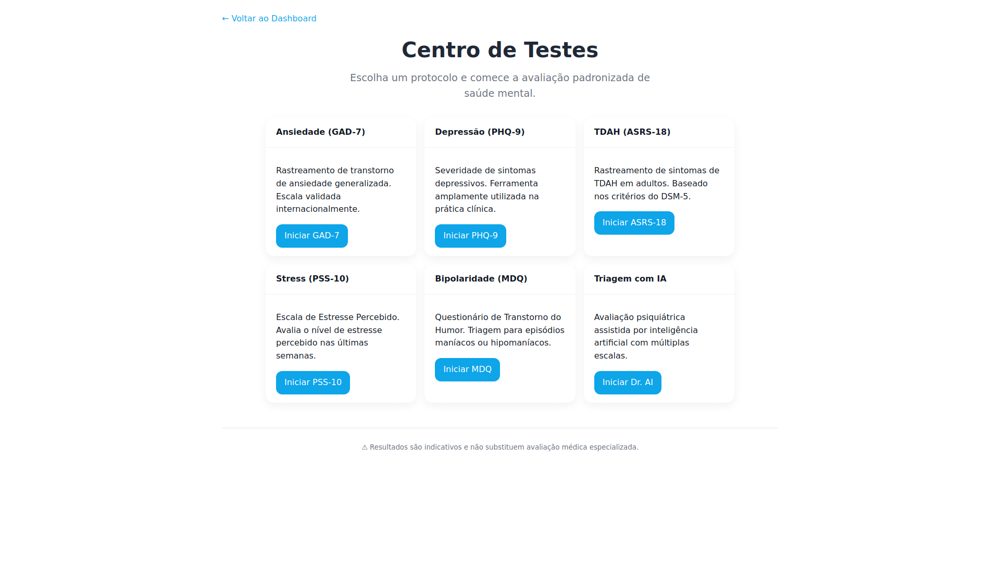

✅ **Status:** Screenshot capturado com sucesso

---

## 📊 Estatísticas

- **Total de páginas:** 17
- **Screenshots capturados:** 16 ✅
- **Erros encontrados:** 1 ❌
- **Taxa de sucesso:** 94%

## 🎯 Como usar este guia

1. **Para demonstrações:** Siga a numeração sequencial (1-17)
2. **Para pacientes:** Foque nas seções 1, 2 e 3  
3. **Para médicos:** Foque nas seções 1, 2 e 4
4. **Para administradores:** Revise todas as seções

## 🔗 Próximos passos

- Acesse o Hub: https://60caaae2-b759-4421-bea0-41165f6b95a2-00-3gqmyfv0qhnan.worf.replit.dev/
- Sistema de avaliação: https://60caaae2-b759-4421-bea0-41165f6b95a2-00-3gqmyfv0qhnan.worf.replit.dev/avaliacao.html
- Documentação técnica: `CONFIGURACAO_AVALIACAO.md`
